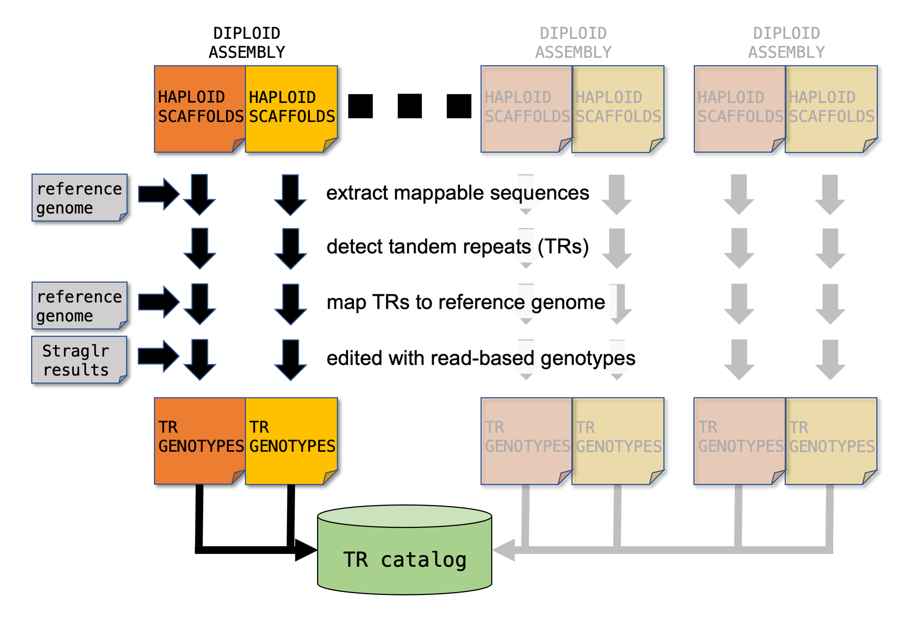

# A tandem repeat (TR) catalog generated from high-quality long-read human genome assemblies
This repository keeps the analysis scripts that were used to generated the TR catalog from public diploid long-read human genome assemblies from the following data soucres:
1. [Human Pangenome Reference Consortium (HPRC)](https://humanpangenome.org/)
2. [Human Genome Structural Variation Consortium (HGSVC2)](https://www.internationalgenome.org/human-genome-structural-variation-consortium/)
3. [1000G ONT Sequencing Consortium](https://millerlaboratory.com/1000G-ONT.html)

## Workflow

